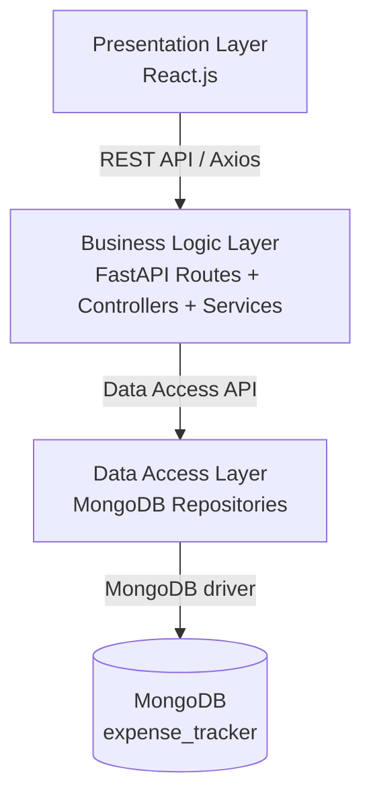

# 💰 Expense Tracker

A full-stack **CRUD web application** for tracking personal expenses, built with **React.js**, **FastAPI**, and **MongoDB**.

The project demonstrates a clean **Three-Tier Architecture** and **MVC principles**: a React presentation layer, a FastAPI business-logic layer, and a MongoDB data-access layer.

---

## 1. Project Title

**Expense Tracker**

---

## 2. Project Description

Expense Tracker is a simple, professional web application that lets users **create, read, update, and delete** their expenses. Each expense stores a title, amount, category, description, and date. Users can:

- View an overview dashboard with totals, recent expenses, and budget progress.
- List all expenses in a sortable table.
- Add new expenses through a validated form.
- Edit existing expenses in a modal.
- Delete expenses with a confirmation dialog.
- Manage expense and budget categories from dedicated tabs.
- Set monthly budgets per category and track spending in real time.

All CRUD operations are performed through a real **REST API** backed by **FastAPI** and **MongoDB** — no mock data, no localStorage.

---

## 3. Features

| Feature | Description |
|---------|-------------|
| **Create Expense** | Add a new expense with title, amount, category, description, and date |
| **Read Expenses** | View all expenses as a table, or view a single expense by ID |
| **Update Expense** | Edit any existing expense, pre-filled with its current data |
| **Delete Expense** | Remove an expense after a confirmation dialog |
| **Expense Categories** | Manage categories used by the expense form (seeded with 9 defaults) |
| **Budget Categories** | Manage a separate set of categories for setting budgets |
| **Budgets** | Set a monthly limit per category with a `YYYY-MM` budget month |
| **Budget Tracking** | Each budget shows `spent` (computed from expenses) and a progress bar |
| **Budget Alerts** | Toast + dashboard banner when spending reaches 80% or exceeds the limit |
| **Dashboard** | Total spent, expense count, highest expense, recent expenses, budget summary |
| **Validation** | Client-side (React) and server-side (Pydantic) validation rules |
| **Error Handling** | Friendly error and empty/loading states across the app |
| **Swagger Docs** | Auto-generated OpenAPI documentation at `/docs` |
| **Responsive UI** | Works on desktop and mobile |

---

## 4. Technology Stack

| Layer | Technology |
|-------|-----------|
| Frontend | React 18, Vite, React Router v6 |
| HTTP Client | Axios |
| Notifications | react-hot-toast |
| Backend | Python, FastAPI |
| Validation | Pydantic v2 |
| Server | Uvicorn (ASGI) |
| Database | MongoDB 7.0 |
| DB Driver | Motor (async MongoDB driver) |
| Docs | Swagger UI / ReDoc (built into FastAPI) |

---

## 5. Architecture

```
┌──────────────────────────────────────────────────────────────┐
│                  PRESENTATION LAYER                          │
│              React.js + Vite (port 5173)                     │
│   pages/ · components/ · services/ · hooks/ · utils/         │
│   Displays data, renders forms, sends HTTP requests          │
└──────────────────────────┬───────────────────────────────────┘
                           │  REST API (HTTP + JSON via Axios)
┌──────────────────────────▼───────────────────────────────────┐
│                  BUSINESS LOGIC LAYER                        │
│              FastAPI + Uvicorn (port 8000)                   │
│   routes/      → HTTP endpoints (views)                      │
│   controllers/ → coordinates requests                        │
│   services/    → business rules & validation                 │
│   models/      → Pydantic schemas (data contracts)           │
│   schemas/     → serialization helpers                       │
└──────────────────────────┬───────────────────────────────────┘
                           │  Data Access Layer API
┌──────────────────────────▼───────────────────────────────────┐
│                   DATA ACCESS LAYER                          │
│               database/ (Motor / PyMongo)                    │
│   mongo.py                  → connection setup                │
│   expense_repository.py     → expense CRUD + spent aggregate  │
│   category_repository.py    → category CRUD queries           │
│   budget_repository.py      → budget CRUD + spent aggregate   │
└──────────────────────────┬───────────────────────────────────┘
                           │  MongoDB wire protocol
┌──────────────────────────▼───────────────────────────────────┐
│                    MONGODB (port 27017)                      │
│              database: expense_tracker                       │
│            collections: expenses · categories · budgets      │
└──────────────────────────────────────────────────────────────┘
```

A Mermaid version of the same diagram:



---

## 6. Three-Tier Architecture Explanation

The application is split into three independent tiers. Each tier only talks to the tier directly below it.

### 1. Presentation Layer (React)

Responsible for **what the user sees and interacts with**:

- Rendering the expense list, dashboard, and forms.
- Handling button clicks, inputs, and navigation.
- Sending HTTP requests to the backend via `src/services/expenseService.js`.
- Showing loading, error, empty, and success states.

It contains **no MongoDB code** and **no business rules**.

### 2. Business Logic Layer (FastAPI)

Responsible for **rules and coordination**:

- `routes/` receive HTTP requests and return HTTP responses.
- `controllers/` coordinate an operation end-to-end.
- `services/` enforce business rules (e.g., categories validated against the database, budgets unique per category + month, amount > 0).
- `models/` validate incoming JSON with Pydantic.

It contains **no MongoDB connection setup** and **no raw database queries** — it delegates all storage to the data layer.

### 3. Data Access Layer (MongoDB repository)

Responsible for **all database work**:

- `database/mongo.py` creates the shared connection and exposes the `expenses`, `categories`, and `budgets` collections.
- `database/expense_repository.py`, `category_repository.py`, `budget_repository.py` implement the actual `insert`, `find`, `update`, and `delete` queries, plus the spent-per-category aggregation.
- Handles `ObjectId` conversion to/from strings.

It contains **no business rules** and **no HTTP logic**.

---

## 7. Project Structure

```
Expense_Tracker/
│
├── backend/
│   ├── main.py                        # FastAPI app, CORS, router registration
│   ├── requirements.txt
│   ├── .env                           # Environment variables (not committed)
│   │
│   ├── database/                      # DATA ACCESS LAYER
│   │   ├── __init__.py
│   │   ├── mongo.py                   # MongoDB connection
│   │   ├── expense_repository.py      # Expense CRUD + spent aggregate
│   │   ├── category_repository.py     # Category CRUD queries
│   │   └── budget_repository.py       # Budget CRUD + spent aggregate
│   │
│   ├── models/                        # Pydantic data contracts
│   │   ├── __init__.py
│   │   ├── expense_model.py           # ExpenseCreate / Update / Response
│   │   ├── category_model.py          # CategoryCreate / Update / Response
│   │   └── budget_model.py            # BudgetCreate / Update / Response
│   │
│   ├── schemas/                       # Serialization helpers
│   │   ├── __init__.py
│   │   └── expense_schema.py
│   │
│   ├── routes/                        # VIEWS — HTTP endpoints
│   │   ├── __init__.py
│   │   ├── expense_routes.py          # /api/expenses endpoints
│   │   ├── category_routes.py         # /api/categories endpoints
│   │   └── budget_routes.py           # /api/budgets endpoints
│   │
│   ├── controllers/                   # Coordinates operations
│   │   ├── __init__.py
│   │   ├── expense_controller.py
│   │   ├── category_controller.py
│   │   └── budget_controller.py
│   │
│   ├── services/                      # BUSINESS LOGIC
│   │   ├── __init__.py
│   │   ├── expense_service.py         # Validation + orchestration
│   │   ├── category_service.py        # Per-type uniqueness + seeding
│   │   └── budget_service.py          # One budget per category+month + spent
│   │
│   └── utils/
│       ├── __init__.py
│       └── helpers.py                 # ObjectId normalization/parsing
│
├── frontend/
│   ├── index.html
│   ├── package.json
│   ├── vite.config.js                 # Dev proxy /api → :8000
│   ├── .env                           # Frontend env vars (not committed)
│   │
│   └── src/
│       ├── main.jsx                   # React entry point
│       ├── App.jsx                    # Router + layout + toaster
│       ├── assets/
│       │   └── index.css              # Global design system (tokens, reset)
│       ├── routes/
│       │   └── AppRoutes.jsx          # Route definitions
│       ├── components/
│       │   ├── Navbar/                # Top navigation
│       │   ├── ExpenseForm/           # Create/edit form (validated)
│       │   ├── ExpenseList/           # Table wrapper + states
│       │   ├── ExpenseCard/           # Single table row
│       │   ├── EditExpenseModal/      # Edit dialog
│       │   ├── DeleteConfirmation/    # Delete confirmation dialog
│       │   ├── ConfirmDialog/         # Reusable confirm dialog
│       │   ├── CategoryForm/          # Add/edit category dialog
│       │   └── BudgetForm/            # Add/edit budget dialog
│       ├── pages/
│       │   ├── Dashboard.jsx          # Overview statistics + budget summary
│       │   ├── Expenses.jsx           # List + edit/delete
│       │   ├── AddExpense.jsx         # Create form page
│       │   ├── Categories.jsx         # Expense & budget category tabs
│       │   └── Budgets.jsx            # Monthly budgets + progress
│       ├── services/
│       │   ├── expenseService.js      # Expense API calls
│       │   ├── categoryService.js     # Category API calls
│       │   └── budgetService.js       # Budget API calls
│       ├── hooks/
│       │   ├── useExpenses.js         # Shared expense list state + fetch
│       │   ├── useCategories.js       # Shared categories by type
│       │   └── useBudgets.js          # Shared budget list state + fetch
│       └── utils/
│           ├── formatters.js          # Currency / date formatting
│           └── validation.js          # Client-side form validation
│
└── README.md
```

---

## 8. Database Structure

**Database:** `expense_tracker`

**Collections:** `expenses`, `categories`, `budgets`

### `expenses`

| Field        | Type     | Description                          |
|--------------|----------|--------------------------------------|
| `_id`        | ObjectId | MongoDB-generated primary key        |
| `title`      | string   | Expense title (required, ≤ 100 chars)|
| `amount`     | float    | Expense amount (required, > 0)       |
| `category`   | string   | Category name (validated against `categories` with type `expense`) |
| `description`| string   | Optional details (≤ 500 chars)       |
| `date`       | string   | Expense date (`YYYY-MM-DD`)          |
| `created_at` | datetime | Server timestamp on creation         |
| `updated_at` | datetime | Server timestamp on last update      |

### `categories`

Categories are separated by **type** — `expense` (used by the expense form) or `budget` (used when setting budgets). Names are unique per type.

| Field        | Type     | Description                          |
|--------------|----------|--------------------------------------|
| `_id`        | ObjectId | MongoDB-generated primary key        |
| `name`       | string   | Category name (unique per type)      |
| `type`       | string   | `"expense"` or `"budget"`            |
| `created_at` | datetime | Server timestamp on creation         |
| `updated_at` | datetime | Server timestamp on last update      |

> On startup the backend seeds **9 default expense categories**: `Food`, `Transport`, `Shopping`, `Bills`, `Entertainment`, `Health`, `Education`, `Travel`, `Other`.

### `budgets`

A budget sets a monthly limit for one category. There can only be **one budget per (category, month)** pair.

| Field        | Type     | Description                          |
|--------------|----------|--------------------------------------|
| `_id`        | ObjectId | MongoDB-generated primary key        |
| `category`   | string   | Category name the budget applies to  |
| `amount`     | float    | Monthly spending limit (> 0)         |
| `month`      | string   | Budget month (`YYYY-MM`)             |
| `created_at` | datetime | Server timestamp on creation         |
| `updated_at` | datetime | Server timestamp on last update      |

> Each budget response also includes a computed **`spent`** field — the sum of expense `amount`s for that category in that month.

> The API exposes `_id` as **`id`** (a string) so clients never see MongoDB's internal `_id` representation.

---

## 9. API Endpoints (REST)

### Expenses

| Method | Endpoint                    | Description                    | Success Code |
|--------|-----------------------------|--------------------------------|--------------|
| GET    | `/api/expenses/`            | Get all expenses               | 200 OK       |
| GET    | `/api/expenses/{expense_id}`| Get a single expense           | 200 OK       |
| POST   | `/api/expenses/`            | Create a new expense           | 201 Created  |
| PUT    | `/api/expenses/{expense_id}`| Update an existing expense     | 200 OK       |
| DELETE | `/api/expenses/{expense_id}`| Delete an expense              | 204 No Content|

### Categories

| Method | Endpoint                     | Description                                    | Success Code |
|--------|------------------------------|------------------------------------------------|--------------|
| GET    | `/api/categories/?type=expense` | List categories (`type` optional; filters to `expense` or `budget`) | 200 OK |
| GET    | `/api/categories/{id}`       | Get a single category                          | 200 OK       |
| POST   | `/api/categories/`           | Create a category (name unique per type)       | 201 Created  |
| PUT    | `/api/categories/{id}`       | Update a category                              | 200 OK       |
| DELETE | `/api/categories/{id}`       | Delete a category                              | 204 No Content|

### Budgets

| Method | Endpoint                  | Description                                          | Success Code |
|--------|---------------------------|------------------------------------------------------|--------------|
| GET    | `/api/budgets/`           | List all budgets (each includes computed `spent`)    | 200 OK       |
| GET    | `/api/budgets/alerts`     | Budgets at warning ≥80% or over (use `?warn=0` for over-only) | 200 OK |
| GET    | `/api/budgets/{budget_id}`| Get a single budget                                  | 200 OK       |
| POST   | `/api/budgets/`           | Create a budget (one per category + month)           | 201 Created  |
| PUT    | `/api/budgets/{budget_id}`| Update a budget                                      | 200 OK       |
| DELETE | `/api/budgets/{budget_id}`| Delete a budget                                      | 204 No Content|

### Budget Alerts

| Method | Endpoint                         | Description                                                       | Success Code |
|--------|----------------------------------|-------------------------------------------------------------------|--------------|
| POST   | `/api/expenses/check-budget`     | Predicts whether a candidate expense (category, amount, date) would push its budget over or to the 80% warning threshold | 200 OK |

> `POST /api/expenses/check-budget` does **not** persist anything. It takes `{ category, amount, date }` and returns the budget status plus projected spend, or an empty body if no budget matches.

**Example request body (POST / PUT expense):**

```json
{
  "title": "Lunch",
  "amount": 250,
  "category": "Food",
  "description": "Lunch at restaurant",
  "date": "2026-09-07"
}
```

**Example budget request body:**

```json
{
  "category": "Groceries",
  "amount": 3000,
  "month": "2026-09"
}
```

**Example budget response (top-level `spent` is computed from the expenses collection):**

```json
{
  "id": "66f9...",
  "category": "Groceries",
  "amount": 3000.0,
  "month": "2026-09",
  "spent": 2000.0,
  "created_at": "2026-09-07T07:00:00",
  "updated_at": "2026-09-07T07:00:00"
}
```

---

## 10. Prerequisites

- **Python** 3.9+
- **Node.js** 18+
- **npm** (ships with Node.js)
- **MongoDB** installed and running locally (default port `27017`)
  - [MongoDB Community Server download](https://www.mongodb.com/try/download/community)

---

## 11. MongoDB Setup

1. Install MongoDB Community Server.
2. Start the MongoDB service. On most systems it runs automatically on `mongodb://localhost:27017`.
3. Verify it is running:

```bash
# PowerShell / macOS / Linux
mongosh --eval "db.adminCommand('ping')"
```

4. The app creates the `expense_tracker` database and `expenses` collection automatically on first insert — **no manual setup required**.

---

## 12. Backend Installation

```bash
cd backend

# Create a virtual environment
python -m venv venv

# Activate it (Windows)
venv\Scripts\activate
# Activate it (macOS/Linux)
source venv/bin/activate

# Install dependencies
pip install -r requirements.txt
```

---

## 13. Frontend Installation

```bash
cd frontend

# Install dependencies
npm install
```

---

## 14. Environment Variables

### Backend (`backend/.env`)

```env
MONGODB_URL=mongodb://localhost:27017
DATABASE_NAME=expense_tracker
```

### Frontend (`frontend/.env`)

```env
VITE_API_URL=http://localhost:8000
```

> `.env` files are ignored by Git (see `.gitignore`). Use the `.env.example` templates in each folder as a reference and never commit secrets.

---

## 15. How to Run Backend

```bash
cd backend
venv\Scripts\activate        # Windows
uvicorn main:app --reload --host 0.0.0.0 --port 8000
```

✅ API running at: http://localhost:8000

---

## 16. How to Run Frontend

```bash
cd frontend
npm run dev
```

✅ App running at: http://localhost:5173

> The Vite dev server proxies `/api/*` requests to `http://localhost:8000`, and CORS is configured for the dev origin as well.


<<<<<<< HEAD
## 17. Swagger Documentation

FastAPI generates interactive API documentation automatically.

- **Swagger UI:** http://localhost:8000/docs
- **ReDoc:** http://localhost:8000/redoc

Each endpoint includes a summary, description, response status codes, and an example request body — useful for trying the API without a frontend.

---
=======
>>>>>>> 074a4ab734f1cc94b0f8a2f90753c18a4dc1c96e

## 18. CRUD Explanation

### CREATE — `POST /api/expenses/`
1. React validates the form and calls `createExpense()` in `expenseService.js`.
2. Axios POSTs JSON to the backend.
3. FastAPI route parses the body into `ExpenseCreate` (Pydantic validates it).
4. `expense_controller` → `expense_service` builds the document (adds `created_at`, `updated_at`).
5. `expense_repository.insert_expense()` writes it to MongoDB.
6. The created expense (with its `id`) is returned with **201 Created**.

### READ — `GET /api/expenses/` and `GET /api/expenses/{id}`
1. The route calls the controller/service.
2. The service validates the ID format (returns **400** if invalid).
3. The repository queries MongoDB.
4. If no document is found for `{id}`, a **404** is returned.
5. Found documents are normalized (`_id` → `id`) and serialized, then returned with **200 OK**.

### UPDATE — `PUT /api/expenses/{id}`
1. The form is pre-filled with existing values.
2. The frontend calls `updateExpense()`.
3. Pydantic (`ExpenseUpdate`) validates the body — all fields optional (partial update).
4. The service only applies provided fields and always stamps a new `updated_at`.
5. The repository runs `$set`. Returns **200 OK** with the updated document, or **404** if missing.

### DELETE — `DELETE /api/expenses/{id}`
1. The user confirms in the delete dialog.
2. The frontend calls `deleteExpense()`.
3. The service validates the ID, then the repository deletes the document.
4. Returns **204 No Content** on success, **404** if not found, **400** for an invalid ID.

### Categories & Budgets
Categories and budgets follow the same layered CRUD flow and add two extra business rules in the service layer:

1. **Per-type uniqueness** — `category_service` runs a case-insensitive name lookup for the same `type` before insert; a duplicate returns **409 Conflict**.
2. **One budget per (category, month)** — `budget_service` checks `find_budget_by_category_month()` before insert; a duplicate month for the same category returns **409 Conflict**.
3. **Spent computation** — after any budget fetch, `budget_repository` aggregates `expense_repository.sum_expenses_by_category(month, category)` to compute `spent`, so budgets always reflect the latest expenses.

### Budget Alerts

Two complementary alert mechanisms keep the user informed at the 80% warning threshold and the 100% over-budget mark:

1. **Predictive toast** — when an expense is created or updated, the frontend calls `POST /api/expenses/check-budget` with `{ category, amount, date }`. The service finds the matching budget, computes the spend *if this expense were added* (`projected = spent + amount`), and returns `status: "ok" | "warning" | "over"`. The frontend shows a warning toast at ≥80% and an error toast once over the limit. This check is non-blocking and never persists data.
2. **Dashboard banner** — `GET /api/budgets/alerts` returns every budget whose `spent / limit` is ≥80%. The Dashboard renders a persistent alert strip listing at-risk (amber) and exceeded (red) categories with a link to manage them.

---

## 19. Error Handling

### Backend

| Scenario                  | Status | Notes                                        |
|---------------------------|--------|----------------------------------------------|
| Invalid ObjectId format   | 400    | e.g. `GET /api/expenses/not-a-valid-id`      |
| Expense not found         | 404    | Valid ID but no matching document            |
| `amount ≤ 0`              | 422    | Pydantic `greater_than` constraint           |
| Unknown expense category  | 422    | Category not in `categories` (type `expense`)|
| Missing required field    | 422    | Pydantic `Field required`                    |
| Invalid date / month      | 422    | Pydantic parsing / `YYYY-MM` regex           |
| Duplicate category name   | 409    | Same name already exists for that type       |
| Duplicate budget          | 409    | Same category already has a budget that month |
| MongoDB connectivity      | 500    | Server-side logs; users get a generic error  |

HTTPException details are returned as `{"detail": "message"}`. Internal Python/MongoDB stack traces are **never** exposed to clients.

### Frontend

- **Loading state** — spinner shown while fetching.
- **Error state** — friendly message when the API is unreachable or fails.
- **Empty state** — helpful prompts when there are no expenses, categories, or budgets.
- **Form validation** — inline per-field error messages before submit.
- **Success feedback** — toast notifications and success banners for create/update/delete.

---

## 20. Future Improvements

- User authentication and per-user expenses.
- Pagination and advanced filtering (by category, date range, month).
- Automated tests (pytest + Playwright) and CI/CD.
- Docker setup for one-command deployment.
- Add a date range filter and export to CSV.

---

## 📖 Useful Commands

<<<<<<< HEAD
| Action                       | Command                                   |
|------------------------------|-------------------------------------------|
| Start backend                | `cd backend && venv\Scripts\activate && uvicorn main:app --reload` |
| Start frontend               | `cd frontend && npm run dev`              |
| Lint frontend                | `cd frontend && npm run lint`             |
| Build frontend (production)  | `cd frontend && npm run build`            |
| Swagger docs                 | http://localhost:8000/docs                |
=======
| Layer | Technology |
|-------|-----------|
| Frontend | React 18, Vite, React Router v6 |
| State | React Context API, Custom hooks |
| HTTP | Axios |
| Charts | Recharts |
| Animations | Framer Motion |
| Notifications | react-hot-toast |
| Backend | FastAPI (Python 3.11) |
| DB Driver | Motor (async) |
| Database | MongoDB 7.0 |


---


>>>>>>> 074a4ab734f1cc94b0f8a2f90753c18a4dc1c96e
